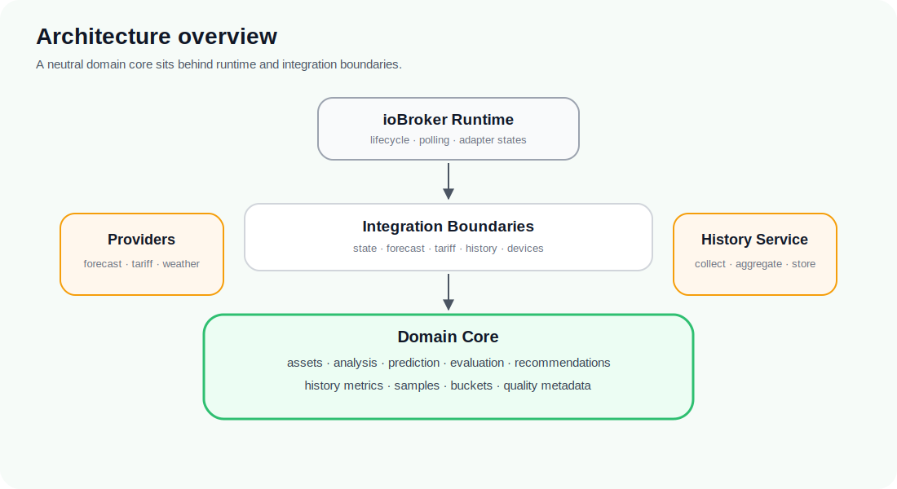

<p align="center">
  
</p>

<p align="center">
  <strong>ioBroker Energy Optimizer</strong><br>
  Public project presentation 2.1
</p>

<p align="center">
  <a href="README.md">Home</a> ·
  <a href="PROJECT_VISION.md">Vision</a> ·
  <a href="KEY_CONCEPTS.md">Key Concepts</a> ·
  <a href="PROJECT_STATUS.md">Status</a> ·
  <a href="FEATURES.md">Features</a> ·
  <a href="USE_CASES.md">Use Cases</a> ·
  <a href="ARCHITECTURE_OVERVIEW.md">Architecture</a> ·
  <a href="ROADMAP.md">Roadmap</a> ·
  <a href="FAQ.md">FAQ</a>
</p>

---

# Architecture Overview

**Document status:** Public presentation, version 2.1, updated 2026-07-08.

`ioBroker.energyoptimizer` follows a Clean Architecture style.

The core idea is simple: energy logic should not depend on ioBroker APIs, concrete vendors, cloud services, or device protocols. Those details belong at the edges of the system.



> **Architecture principle**
>
> The core models the physical energy system. ioBroker, vendors, protocols, and cloud APIs remain integration concerns.

## Layer model

```text
ioBroker runtime / adapters / providers / devices
                 |
                 v
          integration boundaries
                 |
                 v
      deterministic domain components
```

## Domain core

The domain core contains models and pure calculations for:

- energy assets
- energy-system state
- analysis
- forecasts and predictions
- optimization situations
- evaluation
- recommendations
- planning models
- historical metrics and aggregation concepts

Domain components should be portable, testable, and independent from ioBroker object IDs or adapter lifecycle APIs.

## Runtime boundary

The ioBroker adapter runtime is responsible for adapter lifecycle, configuration access, source-state polling, adapter-owned public states, diagnostics, and approved read-only orchestration.

It must not leak vendor-specific details into the domain model.

## Provider boundaries

Future providers may supply forecasts, tariffs, weather data, historical data, or device capabilities.

Examples include photovoltaic forecast services, tariff APIs, weather sources, SQL history backends, device adapters, and protocol integrations.

The core should see these through neutral contracts rather than provider-specific data structures.

## History Service boundary

The planned History Service is the central boundary for past observations and temporal context.

Its responsibilities include typed metrics, samples, buckets, aggregation, quality metadata, retention policy, and repository abstraction. The preferred first persistence direction is to use existing ioBroker SQL infrastructure rather than an adapter-owned database.

## Action boundary

Recommendations and later action planning are intentionally separated.

A recommendation may say what could be useful. A future plan may describe what could be done. Any real-world device behavior remains a later, separately approved project step.

This separation is a safety boundary. The current runtime does not control devices.

## Public object model

The adapter owns its own public ioBroker state namespace. Adapter-owned states may expose live values, costs, health, simulation diagnostics, and recommendation summaries.

Writes to foreign adapter states are not part of the current runtime behavior and require a separate approved milestone.

---

Next: read the [Roadmap](ROADMAP.md) to see how the architecture is planned to grow from read-only recommendations toward safe future planning and automation.
