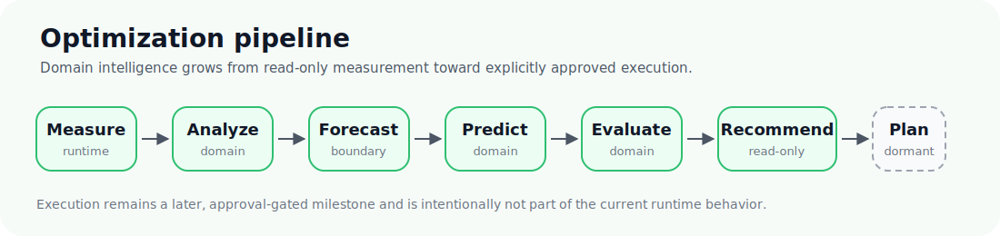

  

  <strong>ioBroker Energy Optimizer</strong> 
  Public project presentation

  <a href="README.md">Home</a> ·
  <a href="PROJECT_VISION.md">Vision</a> ·
  <a href="PROJECT_STATUS.md">Status</a> ·
  <a href="FEATURES.md">Features</a> ·
  <a href="USE_CASES.md">Use Cases</a> ·
  <a href="ARCHITECTURE_OVERVIEW.md">Architecture</a> ·
  <a href="ROADMAP.md">Roadmap</a> ·
  <a href="FAQ.md">FAQ</a>

---

# Features

The Energy Optimizer is designed to grow in carefully validated steps.

It already provides a read-only analytical foundation for understanding energy flows in an ioBroker system. Higher-level optimization, planning, and automation capabilities are built on top of this foundation step by step.

This page therefore describes features as scenarios: what the optimizer can already help with today, what is under development, and what the long-term product is being prepared to achieve.

> **Design rule**
>
> Features are documented as implemented only when they exist in the runtime or domain code. Planned capabilities are marked separately.
>
> The long-term direction is clear: **understand first, recommend next, plan carefully, and only then automate trusted device behavior.**

## Understand the home energy system

The first job of the optimizer is to build a reliable picture of the current energy situation.

Today, the adapter can read configured numeric ioBroker source states and mirror grid, house, photovoltaic, and battery values into adapter-owned states. It also tolerates missing, empty, or non-numeric input values without crashing.

This makes the current runtime intentionally conservative: it observes, validates, and publishes its own view of the energy system before attempting any higher-level decisions.

**Available today**

- read configured numeric ioBroker source states
- mirror grid, house, photovoltaic, and battery values into adapter-owned states
- tolerate missing, empty, or non-numeric input values without crashing
- publish health and configuration status

**Planned capabilities**

- SQL-backed historical data collection through an implementation-neutral repository boundary
- deterministic aggregation and quality metadata for historical observations
- pattern recognition based on confirmed historical behavior

## Track energy and cost development

A useful optimizer must not only know the current power flow. It also needs to understand what this means over time.

The current runtime already calculates interval-based grid-import energy and accumulates daily and monthly fixed-tariff import costs. This turns raw measurements into a first layer of useful energy and cost information.

**Available today**

- calculate interval-based grid-import energy
- accumulate daily fixed-tariff import costs
- accumulate monthly fixed-tariff import costs

**Planned capabilities**

- richer cost models
- dynamic tariff support
- feed-in tariff awareness
- optional battery wear and opportunity-cost modelling

## Predict what happens next

Future optimization depends on more than the current state. The optimizer needs to reason about expected production, consumption, prices, and external conditions.

The repository already contains deterministic domain foundations for forecast abstraction, prediction, time-series merging, energy-system snapshots, and optimizer input construction. These components are designed to be testable without depending directly on ioBroker runtime APIs.

**Available today**

- forecast abstraction in the domain layer
- prediction foundations
- time-series merging foundations
- energy-system snapshot concepts
- optimizer input construction

**Planned capabilities**

- provider integrations for forecast data
- provider integrations for tariff data
- provider integrations for weather data
- prediction based on historical behavior and current context

## Evaluate possible decisions

Before the optimizer can recommend or automate anything, it must be able to compare possible actions safely and deterministically.

The repository already contains foundations for analysis, situation evaluation, recommendation generation, dormant planning model semantics, and read-only simulation diagnostics. These are early building blocks for future decision-making, not autonomous control features.

**Available today**

- analysis foundations
- situation evaluation foundations
- recommendation generation foundations
- dormant planning model semantics
- read-only simulation diagnostics

**Planned capabilities**

- richer efficiency models
- degradation-aware evaluation
- priority and goal models
- simulation framework capabilities such as replay, scenarios, benchmarks, and demo mode

## Recommend better actions

The current project direction is not to jump directly from measurement to automation.

Recommendations are the intermediate step: the optimizer should first explain what it sees, why a certain action would be useful, and what trade-offs are involved. This keeps the system understandable and trustworthy.

**Available today**

- structured read-only recommendation output
- deterministic recommendation generation foundations
- health and configuration status that make recommendations easier to validate

**Planned capabilities**

- user-facing recommendation scenarios
- recommendation quality metadata
- explanations for why a recommendation was produced
- comparison of alternative optimization strategies

## Coordinate energy assets

The long-term product is not limited to passive monitoring. It is being built toward intelligent coordination of energy assets in the home.

Energy assets may include photovoltaic production, batteries, flexible household consumers, thermal storage, heat pumps, electric vehicles, and other controllable loads. The current repository already contains generic energy-asset foundations that can support this direction.

**Available today**

- generic energy-asset domain foundations
- normalized configuration foundations
- deterministic, testable domain components

**Planned capabilities**

- battery-aware optimization
- flexible-load planning
- photovoltaic surplus usage
- thermal energy storage modelling
- heat-pump modelling
- electric-vehicle charging as an optimization dimension
- future vehicle-to-home and vehicle-to-grid concepts

## Prepare trusted automation

Automatic device control is an explicit long-term goal, but it is not a current runtime feature.

The project deliberately avoids uncontrolled automation. Device behavior should only become available after the analytical, recommendation, planning, and validation stages have proven reliable.

**Not current runtime features**

- automatic device control
- appliance scheduling
- direct vendor-cloud control
- writes to third-party ioBroker adapter states
- autonomous optimization actions

**Long-term direction**

- separately approved device-behavior milestones
- transparent planning before control
- user-approved automation paths
- safe coordination of controllable energy assets

The guiding principle remains:

> **Understand → Recommend → Plan → Automate**

## Next: Use cases

This page describes the capabilities the optimizer is being built around.

The next chapter shows how those capabilities can translate into realistic everyday scenarios for a home energy system.

➡️ [Continue with Use Cases](USE_CASES.md)
