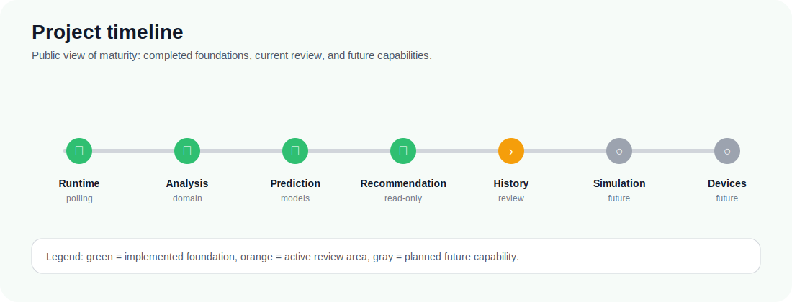

<p align="center">
  
</p>

<p align="center">
  <strong>ioBroker Energy Optimizer</strong><br>
  Public project presentation 2.1
</p>

<p align="center">
  <a href="README.md">Home</a> ·
  <a href="PROJECT_VISION.md">Vision</a> ·
  <a href="KEY_CONCEPTS.md">Key Concepts</a> ·
  <a href="PROJECT_STATUS.md">Status</a> ·
  <a href="FEATURES.md">Features</a> ·
  <a href="USE_CASES.md">Use Cases</a> ·
  <a href="ARCHITECTURE_OVERVIEW.md">Architecture</a> ·
  <a href="ROADMAP.md">Roadmap</a> ·
  <a href="FAQ.md">FAQ</a>
</p>

---

# Project Status

The project is under active development.

The long-term goal is intelligent, explainable energy optimization across the home energy system, including optional device control in later stages. The current runtime intentionally stops before automation: it reads configured ioBroker states, mirrors live energy values, calculates fixed-tariff import costs, publishes diagnostics, and exposes read-only recommendation data.



> **Current status**
>
> The project already demonstrates the core read-only optimization pipeline. The current milestone extends this foundation from live observations toward historical knowledge.

## What already works today

The current prototype can already observe and reason about a home energy system without controlling real devices.

It can:

- collect live energy values from configured ioBroker states
- mirror relevant values into adapter-owned states
- calculate fixed-tariff import costs
- model generic energy assets in a vendor-neutral way
- normalize configuration into a consistent energy-system view
- analyze current energy situations
- use forecast and prediction foundations
- evaluate optimization opportunities
- generate structured, read-only recommendations
- simulate recommendation output without switching devices

This means the optimizer core is already more than a monitor. It contains the first complete foundations for moving from measurement to analysis, prediction, evaluation, and recommendation.

## Current safety boundary

The adapter currently remains read-only with respect to external devices and foreign states.

It does not yet:

- switch devices
- create schedules
- execute optimization plans
- write to foreign ioBroker states
- integrate execution providers
- call external forecast, tariff, or weather providers from the public runtime
- collect SQL history data in the runtime
- perform runtime pattern recognition

This is intentional. The project is designed to understand, explain, and validate optimization behavior before any later stage is allowed to affect real devices.

## Current development focus

The active milestone is about turning past observations into reusable knowledge.

Today, the optimizer can reason about live values and generated inputs. The next step is to make historical behavior available to the domain model so recurring patterns, flexible loads, and user-confirmed virtual assets can become part of future recommendations.

Internally, this milestone is called the **History Service domain foundation**. Its implementation exists, but the milestone is not considered complete until architecture review, validation, and closure are finished.

## Maturity overview

| Capability | Status |
| --- | --- |
| Live energy monitoring | Implemented |
| Adapter-owned state mirroring | Implemented |
| Fixed-tariff cost calculation | Implemented |
| Vendor-neutral energy asset model | Implemented and evolving |
| Analysis, prediction, evaluation, recommendation | Implemented foundations |
| Read-only simulation runtime | Implemented |
| Historical knowledge foundation | Implemented; review pending |
| Pattern-based Virtual Energy Assets | Planned architecture concept |
| SQL/history backend integration | Planned |
| Runtime pattern recognition | Planned |
| Planning and scheduling | Future milestone |
| Device control and automation | Future milestone; approval-gated |

## Path toward automation

The project is not intended to remain a passive analysis tool forever.

The planned direction is:

```text
measure -> analyze -> forecast -> predict -> evaluate -> recommend -> plan -> automate
```

Only the earlier stages are active today. Later stages such as planning, scheduling, and device control will require separate design decisions, explicit approval gates, and validation before they become part of the public runtime.

The goal is not quick automation. The goal is trustworthy automation: a system that can explain why a device should be shifted, charged, discharged, heated, or left untouched before it is ever allowed to act.

## Project quality

The project follows an architecture-first development style. Core domain logic is designed to be deterministic, testable, and independent from vendor APIs or ioBroker runtime details. Public runtime behavior is introduced in stages so new capabilities can be inspected before they affect real devices.

The next section shows which capabilities these foundations already provide and which use cases they are intended to support.
