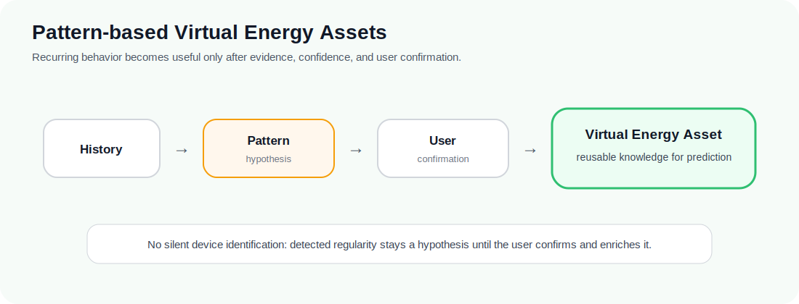

<p align="center">
  
</p>

<p align="center">
  <strong>ioBroker Energy Optimizer</strong><br>
  Public project presentation 2.1
</p>

<p align="center">
  <a href="README.md">Home</a> ·
  <a href="PROJECT_VISION.md">Vision</a> ·
  <a href="KEY_CONCEPTS.md">Key Concepts</a> ·
  <a href="PROJECT_STATUS.md">Status</a> ·
  <a href="FEATURES.md">Features</a> ·
  <a href="USE_CASES.md">Use Cases</a> ·
  <a href="ARCHITECTURE_OVERVIEW.md">Architecture</a> ·
  <a href="ROADMAP.md">Roadmap</a> ·
  <a href="FAQ.md">FAQ</a>
</p>

---

# Project Vision

**Document status:** Public presentation, version 2.1, updated 2026-07-08.

`ioBroker.energyoptimizer` aims to become a modular energy intelligence platform for the whole home energy system.

The long-term goal is to help households understand, predict, and improve how energy is produced, stored, converted, and consumed while keeping the system transparent, deterministic, and safe.

The goal is not another automation rule. The goal is a digital understanding of the home's energy behavior: why energy is needed, when flexibility exists, and which future actions would be useful, safe, and explainable.


> **Vision in one sentence**
>
> Build a safe, explainable energy optimizer that understands the home energy system before it recommends changes.

## Core idea

Home energy systems are becoming more complex. A household may combine grid interaction, renewable generation, electrical and thermal energy storage, electric vehicles and smart charging, heating systems, flexible loads, dynamic tariffs, weather forecasts, historical behavior, and device-specific constraints.

The adapter models these elements as neutral energy assets instead of building logic around a specific vendor, device, protocol, or cloud service.

This means the project is not limited to electricity flows only. It should also be able to reason about energy flexibility across different physical domains, such as storing surplus energy in a battery, shifting a flexible load, or increasing useful thermal storage.

## From data to knowledge

The project direction is not limited to reading live power values. Historical data should become reusable knowledge:

```text
Live values
  -> Historical context
  -> Pattern hypotheses
  -> User-confirmed virtual assets
  -> Better prediction
  -> Better recommendations
```

In everyday terms, this means a home should eventually be able to learn that some loads are flexible, that some surplus windows repeat, that some forecasts are reliable, and that some recommendations worked better than others.



## Guiding principles

- **Vendor-neutral:** energy assets are modeled by physical behavior, not by brand names.
- **Architecture-first:** domain logic is kept independent from ioBroker runtime APIs and integration details.
- **History-driven:** past observations and temporal context become reusable knowledge for multiple consumers.
- **Hypothesis before knowledge:** detected patterns remain uncertain until confirmed by the user.
- **Read-only first:** analysis, diagnostics, and recommendations come before any later automation stage.
- **Explicit approval gates:** later runtime stages require separate, deliberate implementation decisions.
- **Deterministic behavior:** calculations should be predictable, testable, and explainable.
- **Compatibility:** existing public states and legacy configuration fields remain stable unless a migration is explicitly approved.

## Long-term direction

The intended optimization pipeline is:

```text
measure -> analyze -> forecast -> predict -> evaluate -> recommend -> plan
```

The current project focuses on building this pipeline safely from the inside out: domain models and pure engines first, runtime integration second, later automation stages last.

Over time, this foundation should allow the system to move from observation to useful recommendations and carefully reviewed planning.

## Why this matters

A useful energy optimizer should not simply react whenever surplus power appears. It needs to understand timing, forecasts, battery state, thermal context, electric vehicle charging, tariff context, comfort constraints, recurring behavior, priorities, and safety boundaries.

That is what makes the project more than a collection of calculations. It is designed to help a household understand its own energy behavior first, then receive useful recommendations, and only later consider safe planning or automation.

The project is therefore designed as a foundation for gradual, reviewable energy intelligence rather than as a quick automation script. Its purpose is to help the home energy system become understandable first, useful second, and extensible when the underlying behavior is clear enough to justify it.

---

Next: read the [Key Concepts](KEY_CONCEPTS.md) to see the architecture ideas behind this vision.
