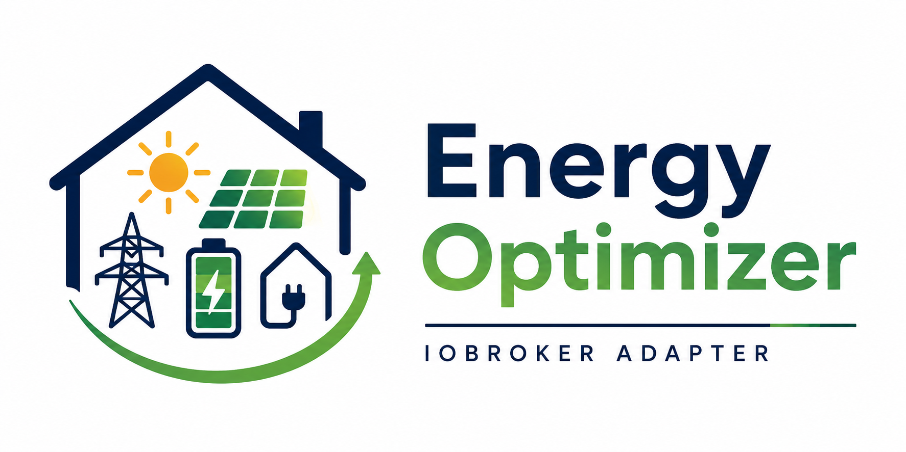

<p align="center">
  
</p>

<p align="center">
  <strong>ioBroker Energy Optimizer</strong><br>
  Public project presentation
</p>

<p align="center">
  <a href="README.md">Home</a> ·
  <a href="PROJECT_VISION.md">Vision</a> ·
  <a href="PROJECT_STATUS.md">Status</a> ·
  <a href="FEATURES.md">Features</a> ·
  <a href="USE_CASES.md">Use Cases</a> ·
  <a href="ARCHITECTURE_OVERVIEW.md">Architecture</a> ·
  <a href="ROADMAP.md">Roadmap</a> ·
  <a href="FAQ.md">FAQ</a>
</p>

---

# Project Vision

`ioBroker.energyoptimizer` aims to become a modular energy optimization platform for ioBroker.

The long-term goal is to help households understand, predict, and improve their energy behavior while keeping the system transparent, deterministic, and safe.

> **Vision in one sentence**
>
> Build a safe, explainable energy optimizer that understands the home energy system before it ever controls it.

## Core idea

Home energy systems are becoming more complex. A household may combine grid import and export, photovoltaic generation, battery storage, flexible loads, variable tariffs, weather forecasts, and device-specific constraints.

The adapter models this as a neutral energy system instead of building logic around a specific vendor, device, protocol, or cloud service.

## Guiding principles

- **Vendor-neutral:** energy assets are modeled by physical behavior, not by brand names.
- **Architecture-first:** domain logic is kept independent from ioBroker runtime APIs and integration details.
- **Read-only before control:** analysis, diagnostics, and recommendations come before any execution capability.
- **Explicit approval gates:** runtime behavior changes and device execution require separate, deliberate implementation decisions.
- **Deterministic behavior:** calculations should be predictable, testable, and explainable.
- **Compatibility:** existing public states and legacy configuration fields remain stable unless a migration is explicitly approved.

## Long-term direction

The intended optimization pipeline is:

```text
measure -> analyze -> forecast -> predict -> evaluate -> recommend -> plan -> execute
```

The current project focuses on building this pipeline safely from the inside out: domain models and pure engines first, runtime integration second, device control last.

## Why this matters

A useful energy optimizer should not simply switch devices whenever surplus power appears. It needs to understand timing, forecasts, battery state, tariff context, comfort constraints, priorities, and safety boundaries.

The project is therefore designed as a foundation for gradual, reviewable energy intelligence rather than as a quick automation script.
