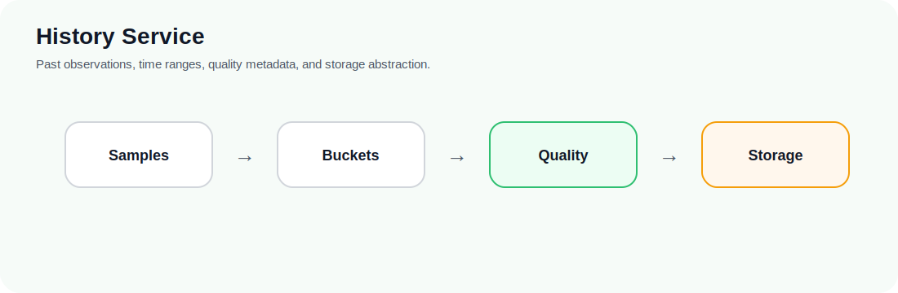
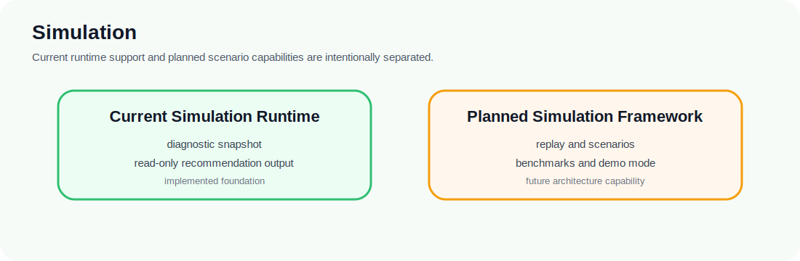

  

  <strong>ioBroker Energy Optimizer</strong> 
  Public project presentation

  <a href="README.md">Home</a> ·
  <a href="PROJECT_VISION.md">Vision</a> ·
  <a href="PROJECT_STATUS.md">Status</a> ·
  <a href="FEATURES.md">Features</a> ·
  <a href="USE_CASES.md">Use Cases</a> ·
  <a href="ARCHITECTURE_OVERVIEW.md">Architecture</a> ·
  <a href="ROADMAP.md">Roadmap</a> ·
  <a href="FAQ.md">FAQ</a>

---

# Roadmap

This roadmap summarizes the public direction at a high level. It does not replace the detailed project roadmap in [`../roadmap/ROADMAP.md`](../roadmap/ROADMAP.md).

> **Roadmap rule**
>
> Runtime changes, history integration, and device behavior are split into explicit milestones. Planned direction does not imply current runtime behavior.

## Completed foundations

The project has established the main architectural and domain foundations:

- ioBroker adapter lifecycle and safe polling
- live value mirroring
- fixed-tariff import-cost calculation
- generic energy assets
- normalized configuration
- analysis, forecast abstraction, prediction, evaluation, and recommendation foundations
- read-only simulation runtime integration
- structured read-only recommendation output
- dormant planning model semantics

## Current milestone

The current milestone is the History Service domain foundation.

Its purpose is to establish implementation-neutral history concepts before integrating a concrete backend or runtime collection path.

The milestone is not complete until architecture review and validation are finished.

## Next likely direction: History Service integration

The History Service is expected to become the central source for past observations and temporal context.

Planned topics include:

- typed historical metrics
- sample and bucket models
- deterministic aggregation
- quality metadata
- retention policies
- repository abstraction
- SQL-backed persistence through existing ioBroker infrastructure
- consumers such as prediction, diagnostics, simulation, and later optimization

## Later direction: provider integrations

Future provider work may include:

- photovoltaic forecast providers
- tariff providers
- weather providers
- device capability providers

Provider integrations should remain behind neutral boundaries.

## Later direction: pattern knowledge

A future Pattern Recognition Engine may use historical data to detect recurring household behavior.

Detected patterns should remain hypotheses until confirmed by the user. Confirmed patterns may become device-neutral virtual energy assets for prediction and optimization.

## Later direction: simulation framework

A future first-class Simulation Framework may support:

- replay mode
- accelerated time
- scenario libraries
- benchmark scenarios
- demonstration mode
- synthetic data generation
- regression testing

This is a long-term architecture capability. Its implementation order is still open.

## Long-term direction: controlled device behavior

Device behavior is planned but approval-gated.

Before this can be safe, the project needs reliable recommendations, planning semantics, validation, conflict handling, provider boundaries, user approval rules, and runtime safety controls.

The current runtime stops at read-only recommendation output.
